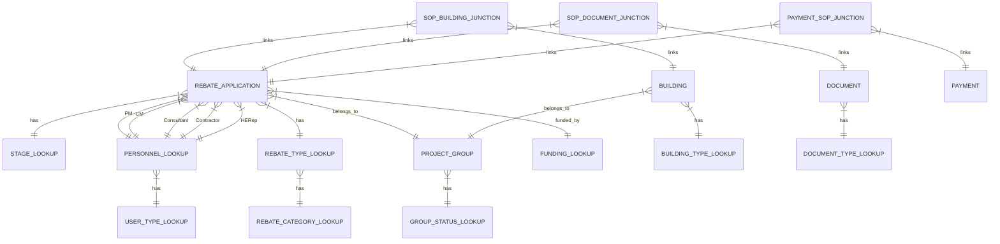

# Relationship Inventory Table

| Entity | Relationship | Target Entity | Cardinality | Notes / RTM Reference |
| :--- | :--- | :--- | :--- | :--- |
| REBATE_APPLICATION | has | STAGE_LOOKUP | M:1 | A single Rebate Application is in exactly one Stage. |
| STAGE_LOOKUP | is used by | REBATE_APPLICATION | 1:M | A single Stage can apply to many Rebate Applications. |
| REBATE_APPLICATION | belongs to | PROJECT_GROUP | M:1 | Many Rebate Applications (SOPs) are tied to a single Project Group. |
| PROJECT_GROUP | contains | REBATE_APPLICATION | 1:M | A Project Group can contain many Rebate Applications (SOPs). |
| PROJECT_GROUP | has | GROUP_STATUS_LOOKUP | M:1 | A Project Group is assigned exactly one status from the lookup table. |
| GROUP_STATUS_LOOKUP | is used by | PROJECT_GROUP | 1:M | A single Group Status can be assigned to many Project Groups. |
| PERSONNEL_LOOKUP | has | USER_TYPE_LOOKUP | M:1 | Many individuals belong to one security role. |
| USER_TYPE_LOOKUP | is used by | PERSONNEL_LOOKUP | 1:M | One security role can be assigned to many individuals. |
| REBATE_TYPE_LOOKUP | has | REBATE_CATEGORY_LOOKUP | M:1 | Many Types belong to one parent Category (Cascading lookup). |
| REBATE_CATEGORY_LOOKUP | is used by | REBATE_TYPE_LOOKUP | 1:M | One Category defines many possible Types. |
| REBATE_APPLICATION | has | REBATE_TYPE_LOOKUP | M:1 | A single SOP is assigned exactly one Rebate Type. |
| REBATE_TYPE_LOOKUP | is used by | REBATE_APPLICATION | 1:M | One Rebate Type can apply to many SOPs. |
| REBATE_APPLICATION | has Funding Source | FUNDING_LOOKUP | M:1 | Link via Funding_ID. |
| FUNDING_LOOKUP | is assigned to | REBATE_APPLICATION | 1:M | A single Funding Source can be assigned to many SOPs. |
| REBATE_APPLICATION | has Project Manager | PERSONNEL_LOOKUP | M:1 | Link via Project_Manager_ID (RTM P2.8). |
| REBATE_APPLICATION | has Construction Mgr | PERSONNEL_LOOKUP | M:1 | Link via Construction_Manager_ID (RTM P2.8). |
| REBATE_APPLICATION | has Consultant | PERSONNEL_LOOKUP | M:1 | Link via Consultant_ID (RTM P2.8). |
| REBATE_APPLICATION | has Contractor | PERSONNEL_LOOKUP | M:1 | Link via Contractor_ID (RTM P2.8). |
| REBATE_APPLICATION | has HE Representative | PERSONNEL_LOOKUP | M:1 | Link via HE_Representative_ID (RTM P2.8). |
| BUILDING | belongs to | PROJECT_GROUP | M:1 | Many Buildings are contained within a single Project Group. (Non-Mandatory) |
| PROJECT_GROUP | contains | BUILDING | 1:M | A Project Group manages many physical building assets. |
| BUILDING | has | BUILDING_TYPE_LOOKUP | M:1 | Many Buildings are classified by one Building Type/FICM Code. |
| BUILDING_TYPE_LOOKUP | is used by | BUILDING | 1:M | One standardized Type can classify many buildings. |
| SOP_BUILDING_JUNCTION | links to | REBATE_APPLICATION | M:1 | The junction record links back to one specific SOP measure (RTM P3.6). |
| REBATE_APPLICATION | links to | SOP_BUILDING_JUNCTION | 1:M | One SOP measure can be linked to many buildings (via the junction table). |
| SOP_BUILDING_JUNCTION | links to | BUILDING | M:1 | The junction record links to one specific physical building. |
| BUILDING | links to | SOP_BUILDING_JUNCTION | 1:M | One physical Building can host many SOP measures (via the junction table). |
| REBATE_APPLICATION | was created by | PERSONNEL_LOOKUP | M:1 | Link via Added_By_ID for accountability (RTM P4.1). |
| PERSONNEL_LOOKUP | created | REBATE_APPLICATION | 1:M | Link via Added_By_ID. |
| REBATE_APPLICATION | was last modified by | PERSONNEL_LOOKUP | M:1 | Link via Modified_By_ID for accountability (RTM P4.1). |
| PERSONNEL_LOOKUP | last modified | REBATE_APPLICATION | 1:M | Link via Modified_By_ID. |
| PROJECT_GROUP | was created by | PERSONNEL_LOOKUP | M:1 | Link via Added_By_ID for accountability (RTM P4.1). |
| PERSONNEL_LOOKUP | created | PROJECT_GROUP | 1:M | Link via Added_By_ID. |
| PROJECT_GROUP | was last modified by | PERSONNEL_LOOKUP | M:1 | Link via Modified_By_ID for accountability (RTM P4.1). |
| PERSONNEL_LOOKUP | last modified | PROJECT_GROUP | 1:M | Link via Modified_By_ID. |
| BUILDING | was created by | PERSONNEL_LOOKUP | M:1 | Link via Added_By_ID for accountability (RTM P4.1). |
| PERSONNEL_LOOKUP | created | BUILDING | 1:M | Link via Added_By_ID. |
| BUILDING | was last modified by | PERSONNEL_LOOKUP | M:1 | Link via Modified_By_ID for accountability (RTM P4.1). |
| PERSONNEL_LOOKUP | last modified | BUILDING | 1:M | Link via Modified_By_ID. |
| DOCUMENT | was created by | PERSONNEL_LOOKUP | M:1 | Link via Added_By_ID for accountability (RTM P4.1). |
| PERSONNEL_LOOKUP | created | DOCUMENT | 1:M | Link via Added_By_ID. |
| DOCUMENT | was last modified by | PERSONNEL_LOOKUP | M:1 | Link via Modified_By_ID for accountability (RTM P4.1). |
| PERSONNEL_LOOKUP | last modified | DOCUMENT | 1:M | Link via Modified_By_ID. |
| PAYMENT | was created by | PERSONNEL_LOOKUP | M:1 | Link via Added_By_ID for accountability (RTM P4.1). |
| PERSONNEL_LOOKUP | created | PAYMENT | 1:M | Link via Added_By_ID. |
| PAYMENT | was last modified by | PERSONNEL_LOOKUP | M:1 | Link via Modified_By_ID for accountability (RTM P4.1). |
| PERSONNEL_LOOKUP | last modified | PAYMENT | 1:M | Link via Modified_By_ID. |
| DOCUMENT | has | DOCUMENT_TYPE_LOOKUP | M:1 | RTM P6.1: Documents are categorized by a single Document Type. |
| DOCUMENT_TYPE_LOOKUP | is used by | DOCUMENT | 1:M | RTM P6.1: One Document Type can categorize many documents. |
| SOP_DOCUMENT_JUNCTION | links to | REBATE_APPLICATION | M:1 | RTM P6.1: The junction record links back to one specific SOP measure. |
| REBATE_APPLICATION | links to | SOP_DOCUMENT_JUNCTION | 1:M | RTM P6.1: One SOP measure can be linked to many documents. |
| SOP_DOCUMENT_JUNCTION | links to | DOCUMENT | M:1 | RTM P6.1: The junction record links to one specific document asset. |
| DOCUMENT | links to | SOP_DOCUMENT_JUNCTION | 1:M | RTM P6.1: One Document asset can be linked to many SOP measures. |
| PAYMENT | links to | PAYMENT_SOP_JUNCTION | 1:M | RTM P8.1: One check/payment can cover many SOPs (via junction). |
| PAYMENT_SOP_JUNCTION | links to | PAYMENT | M:1 | RTM P8.1: The junction record links to one specific payment. |
| REBATE_APPLICATION | links to | PAYMENT_SOP_JUNCTION | 1:M | RTM P8.1: One SOP can be paid by one check (via junction). |
| PAYMENT_SOP_JUNCTION | links to | REBATE_APPLICATION | M:1 | RTM P8.1: The junction record links to one specific SOP. |
